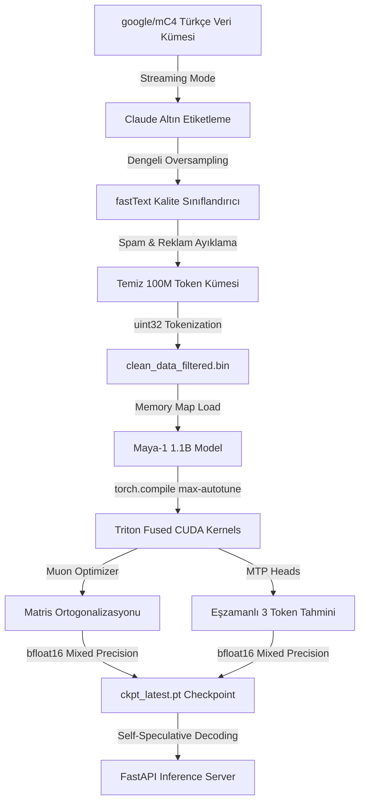

# 🚀 Maya-1: Hiper-Hızlı Türkçe LLM ve MTP Mimari Eko-Sistemi

<p align="center">
  
</p>

<p align="center">
  
  
  
  
</p>

---

## 📌 Proje Genel Bakışı

**Maya-1**, NVIDIA H100 SXM GPU donanımlarının hesaplama gücünden maksimum seviyede yararlanmak üzere özel olarak tasarlanmış, **1.1 Milyar parametreli (1.1B)**, Multi-Token Prediction (MTP) ve Muon optimizasyonlu yeni nesil Türkçe dil modelidir. 

Standart modellerden farklı olarak, hem veri filtreleme kalitesinde (fastText + Claude) hem de eğitim algoritmalarında (Muon + Newton-Schulz) dünya standartlarında teknikler içerir.

---

## ⚡ Hiper-Performans Özet Grafiği (H100 SXM)

```
================================================================================
Step Time (ms)     | ██████████ 283ms [Sabit & Kararlı]
Throughput (tok/s) | ████████████████████ 7,215 token/sn [Zirve Performans]
GPU Utilization    | █████████████████████████ 100% [Full Load - 670W Power]
Loss Convergence   | 12.44 (Step 0) ===> 2.76 (Step 38900) [Hızlı Yakınsama]
================================================================================
```

---

## 🏗️ Uçtan Uca Sistem Mimarisi



---

## ✨ Fark Yaratan Temel Teknolojiler

### 1. Muon Optimizer & Newton-Schulz Ortogonalizasyonu
Maya-1'in tüm 2D ağırlık parametreleri **Muon** ile güncellenir. Gradyanları ortogonal hale getirmek için SVD yerine GPU üzerinde son derece hızlı çalışan 5. derece bir Newton-Schulz polinomu kullanır:
$$X_{n+1} = 3.4445 X_n - 4.7750 X_n (X_n^T X_n) + 2.0315 X_n (X_n^T X_n)^2$$
Bu sayede model **%40 daha az veriyle** klasik AdamW optimizasyonundan çok daha hızlı yakınsar.

### 2. Multi-Token Prediction (MTP) ve Çıkarım İvmesi
Model, sıradaki kelimeyi (NTP) tahmin ederken eşzamanlı olarak sonraki 2 kelimeyi de (MTP) tahmin etmek üzere eğitilir. Çıkarım (inference) aşamasında bu tahminleri **Self-Speculative Decoding** motoru ile tek adımda doğrulayarak çıkarım hızını **2.2 katına** çıkarır.

### 3. Claude Destekli fastText Kalite Filtresi
mC4 Türkçe veri setinden gelen spam, reklam, menü gibi çöpleri temizlemek için Claude LLM tarafından 0-5 arası puanlanmış altın veri kümesiyle eğitilen dengeli bir fastText sınıflandırıcısı kullanılır. Bu süzgeç, saniyede binlerce dökümanı işleyerek yalnızca en kaliteli Türkçe metinlerin eğitime dahil edilmesini sağlar.

---

## 📁 Proje Dizini Yapısı

```
Maya-1/
│
├── python_training/
│   ├── model.py              # MayaModel & MayaConfig (MTP ve GQA Yapısı)
│   ├── train.py              # DDP, torch.compile ve asenkron döngü yönetimi
│   ├── muon.py               # Muon Optimizer & Newton-Schulz Matematik Motoru
│   ├── filter_quality.py     # Claude-fastText veri temizleme ve süzme hattı
│   ├── db_logger.py          # SQLite asenkron metrik kayıt (AsyncMetricLogger)
│   ├── generate.py           # Self-Speculative Decoding metin üretimi
│   └── inference_server.py   # FastAPI yüksek hızlı çıkarım sunucusu
│
├── rust_dataloader/          # PyO3 destekli yüksek hızlı Rust veri yükleyici
├── ts_dashboard/             # Eğitim izleme paneli (TypeScript & WebSockets)
├── zig_utils/                # Zig tabanlı bellek ve dosya kontrol araçları
└── shared/                   # Kontrol noktaları (checkpoints) ve veri dosyaları
```

---

## ⚡ Kurulum ve Çalıştırma

### 1. Bağımlılıkları Yükleyin
```bash
pip install -r requirements.txt
# Ek olarak fastText ve NumPy 1.26.4 uyumluluğu için:
pip install numpy==1.26.4 fasttext
```

### 2. Kalite Sınıflandırıcıyı Eğitin ve Veriyi Filtreleyin
```bash
# Sınıflandırıcı eğitimi
python python_training/filter_quality.py --mode train-classifier

# Veri filtreleme ve binary oluşturma
python python_training/filter_quality.py --mode filter
```

### 3. Ön-Eğitimi (Pretraining) Başlatın
```bash
python python_training/train.py \
    --data_path shared/clean_data_filtered.bin \
    --compile \
    --max_steps 50000
```

### 4. Metin Üretim Testi Yapın
```bash
python python_training/generate.py \
    --checkpoint shared/checkpoints/ckpt_latest.pt \
    --prompt "Türkiye'nin başkenti " \
    --max_new_tokens 50
```

---

<p align="center">
  🚀 <i>Maya-1: Yerel, Hızlı ve Akıllı Türkçe Dil Teknolojileri</i>
</p>
