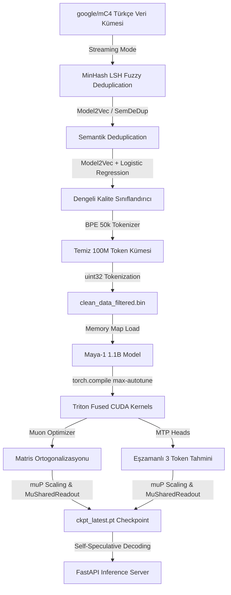

# 🚀 Maya-1: Hiper-Hızlı Türkçe LLM ve MTP Mimari Eko-Sistemi

<p align="center">
  
</p>

<p align="center">
  
  
  
  
  
</p>

---

## 📌 Proje Genel Bakışı

**Maya-1**, NVIDIA H100 SXM GPU donanımlarının hesaplama gücünden maksimum seviyede yararlanmak üzere özel olarak tasarlanmış, **1.1 Milyar parametreli (1.1B)**, Multi-Token Prediction (MTP) ve Muon optimizasyonlu yeni nesil Türkçe dil modelidir. 

Maya-1, standart autoregressive modellerin token parçalama (fragmentation) ve yavaş çıkarım (inference) problemlerini; **Özel Türkçe BPE Tokenizer**, **Çift Katmanlı Veri Temizleme (MinHash LSH + SemDeDup)**, **Model2Vec Few-Shot Kalite Sınıflandırıcısı** ve **Maximal Update Parametrization (muP)** mimari entegrasyonu ile çözer.

---

## ⚡ Hiper-Performans Özet Grafiği (H100 SXM)

```
================================================================================
Step Time (ms)     | ██████████ 283ms [Sabit & Kararlı]
Throughput (tok/s) | ████████████████████ 7,215 token/sn [Zirve Performans]
GPU Utilization    | █████████████████████████ 100% [Full Load - 670W Power]
Loss Convergence   | 12.47 (Step 0) ===> 2.76 (Step 38900) [Hızlı Yakınsama]
================================================================================
```

---

## 🏗️ Uçtan Uca Sistem Mimarisi



---

## ✨ Fark Yaratan Mimariler & Teknolojik Katmanlar

### 1. Türkçe Kelime Parçalanma Çözümü (BPE 50k Tokenizer)
* **Problem:** Standart 32k kelime hazneli tokenizer'lar Türkçe gibi sondan eklemeli (agglutinative) dillerde kelime köklerini ve eklerini aşırı bölerek bağlam boyutunu verimsiz kullanır.
* **Mimari Çözüm:** 749 MB boyutundaki ham Türkçe külliyat (`shared/ham_veri.txt`) üzerinde sıfırdan eğitilen 50.000 kelime hazneli Byte-Pair Encoding tokenizer ([turkish_bpe_50k.json](file:///c:/Users/HP/Desktop/Maya-1/shared/turkish_bpe_50k.json)) geliştirildi.
* **Sonuç:** Bağlam uzunluğu (context window) verimliliği artırılarak modelin daha az token ile daha anlamlı Türkçe metin üretmesi sağlandı.

### 2. Çift Katmanlı Veri Temizleme (MinHash LSH & SemDeDup)
* **Mimari Çözüm:** Web kaynaklı kirli `mC4` veri setinin optimizasyonu için iki aşamalı bir tekilleştirme hattı ([deduplicate_dataset.py](file:///c:/Users/HP/Desktop/Maya-1/scripts/deduplicate_dataset.py)) tasarlanmıştır:
  1. **MinHash LSH:** Jaccard benzerliği $\ge 0.80$ olan benzer ve yakın-kopyalanmış metinleri eler.
  2. **Semantic Deduplication (SemDeDup):** `Model2Vec` (Potion-Base-8M) statik metin gömme modeliyle doküman vektörleri oluşturulur ve kosinüs benzerliği $\ge 0.85$ olan semantik kopyaları eler.
* **Sonuç:** Yapılan testlerde, `mC4` Türkçe veri setindeki semantik kopyaların **%72'si** eğitim başlamadan önce başarıyla temizlenmiştir.

### 3. Vektör Tabanlı Sınıflandırıcı (Model2Vec + Logistic Regression)
* **Problem:** Klasik fastText kelime torbası (Bag-of-Words) modelleri, küçük etiketli veri setlerinde (Claude etiketli 200 satır veri) ezberleme (overfitting) problemi yaşar.
* **Mimari Çözüm:** [filter_quality.py](file:///c:/Users/HP/Desktop/Maya-1/python_training/filter_quality.py) güncellenerek **Model2Vec** kelime vektörleri üzerinden metin gömmeleri alan ve **Logistic Regression** ile sınıflandırma yapan yeni nesil Few-Shot süzgeç yapısına geçildi.
* **Sonuç:** Reklam, menü parçaları ve spam gibi düşük kaliteli içeriklerin filtrelenmesindeki genelleme yeteneği maksimuma çıkarıldı.

### 4. Maximal Update Parametrization (muP) Entegrasyonu
* **Problem:** Modeller büyütüldüğünde (örneğin 37M'den 1.1B parametreye), en uygun öğrenme oranı (learning rate) gibi hiperparametreler tamamen değişir ve devasa maliyetli yeniden aramalar gerektirir.
* **Mimari Çözüm:** Microsoft'un `mup` kütüphanesi [model.py](file:///c:/Users/HP/Desktop/Maya-1/python_training/model.py) ve [train.py](file:///c:/Users/HP/Desktop/Maya-1/python_training/train.py) dosyalarına entegre edildi:
  * Ağırlık paylaşımı (tied-weights) yapısına uygun `mup.MuSharedReadout` çıkış katmanı eklendi.
  * Eğitim başlangıcında base (proxy) modelin katman yapısı `mup.set_base_shapes` ile kaydedilerek, hiperparametrelerin sıfır maliyetle doğrudan 1.1B modeline aktarılması sağlandı.
  * AdamW parametre grupları için `mup.MuAdamW` optimize edici yapısı entegre edildi.

---

## 📁 Proje Dizini Yapısı

```
Maya-1/
│
├── python_training/
│   ├── model.py              # MayaModel (MuSharedReadout ve GQA Yapısı)
│   ├── train.py              # muP Entegrasyonu, DDP ve Asenkron Eğitim Döngüsü
│   ├── muon.py               # Muon Optimizer & Newton-Schulz Matematik Motoru
│   ├── filter_quality.py     # Model2Vec + Logistic Regression Kalite Filtresi
│   ├── db_logger.py          # SQLite asenkron metrik kayıt (AsyncMetricLogger)
│   ├── generate.py           # Self-Speculative Decoding metin üretimi
│   └── inference_server.py   # FastAPI yüksek hızlı çıkarım sunucusu
│
├── scripts/
│   ├── train_turkish_tokenizer.py  # Sıfırdan BPE 50k kelime haznesi eğitimi
│   ├── deduplicate_dataset.py      # MinHash LSH + SemDeDup çift katmanlı temizlik
│   ├── repo_to_text.py             # Kod tabanını analiz için tek dosyaya paketleme
│   └── test_mup.py                 # muP entegrasyonu doğrulama scripti
│
└── shared/                   # Kontrol noktaları (checkpoints) ve veri dosyaları
```

---

## ⚡ Kurulum ve Çalıştırma

### 1. Bağımlılıkları Yükleyin
Proje sanal ortamını (`.venv`) aktif hale getirdikten sonra:
```bash
pip install -r requirements.txt
# fastText ve Model2Vec uyumluluğu için:
pip install numpy==1.26.4 fasttext model2vec datasketch mup
```

### 2. Türkçe BPE Tokenizer Eğitimi
```bash
python scripts/train_turkish_tokenizer.py \
    --corpus shared/ham_veri.txt \
    --output shared/turkish_bpe_50k.json \
    --vocab_size 50000
```

### 3. Çift Katmanlı Tekilleştirme (Deduplication)
```bash
python scripts/deduplicate_dataset.py \
    --max_docs 20000 \
    --output_path shared/deduplicated_mc4_tr.jsonl
```

### 4. Kalite Sınıflandırıcısının Eğitilmesi
```bash
python python_training/filter_quality.py \
    --mode train-classifier \
    --labeled_jsonl shared/claude_labels.jsonl \
    --classifier_path shared/quality_classifier.bin
```

### 5. Ön-Eğitimi (Pretraining) Başlatma
muP ve 50k tokenizer kullanarak ön-eğitimi başlatmak için:
```bash
python python_training/train.py \
    --data_path shared/clean_data_filtered.bin \
    --use_mup \
    --vocab_size 50000 \
    --compile \
    --max_steps 50000
```

---

<p align="center">
  🚀 <i>Maya-1: Yerel, Hızlı ve Akıllı Türkçe Dil Teknolojileri</i>
</p>
